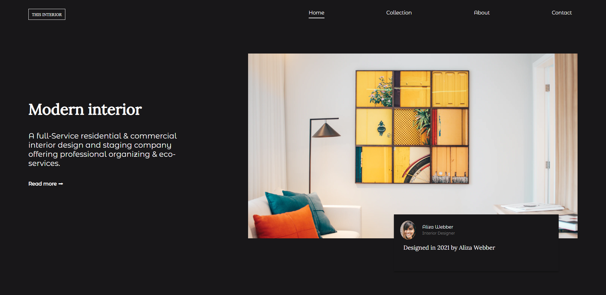
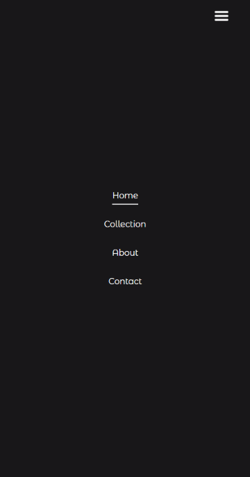

# INTERIOR-CONSULTANT - Responsive website

## Overview

<h3>
    <a href="https://interior-consultant-website-by-sumyataung.netlify.app/">
 Demo / Website URL - https://interior-consultant-website-by-sumyataung.netlify.app/
    </a>
</h3>

 
 

 
 

 
 

 
 

### Built With

- I built this **responsive website** using  
  **HTML**,  
  **Pure CSS** and  
  **Vanilla Javascript**  

## Features

- **responsive and look great on all devices**
- **Fonts** are clean and readable
- **Color Simple and classic**
- **Underline Hover effect**
